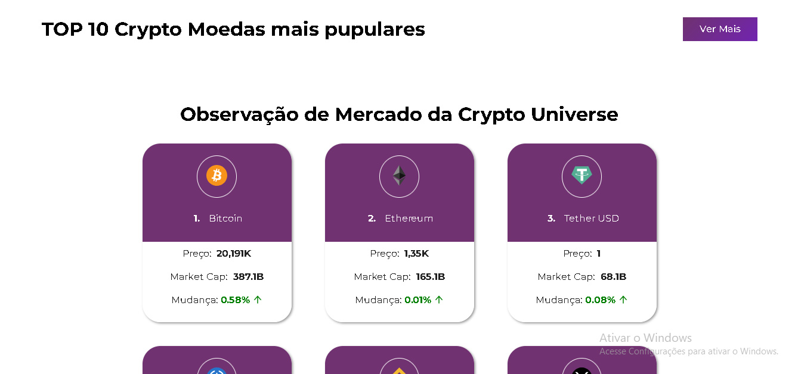
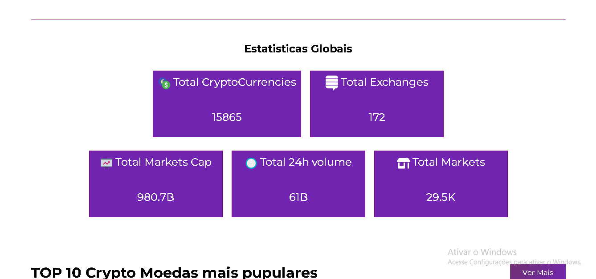

# ⚠️ Projeto ainda em Desenvolvimento

# 📷 Demonstração

  

 

# 💻 Crypto-Universe 

Aplicação web desenvolvida em react e RTK query para consulta e acomapanhamento de noticias e as informações relacionadas as principais cripto moedas e exchanges do mercado, quando finalizado sera possivel adicionar os tokens de maior interrese em uma lista de interrese/favoritos para um acompanhamento individual.  

 

# 🛠 Tecnologias Ultilizadas

### As tecnologias ultilizadas neste projeto foram:

✔️JavaScript

✔️React

✔️React Hooks

✔️Css modules

✔️Redux toolkit query

✔️moment 

✔️Chart Js

